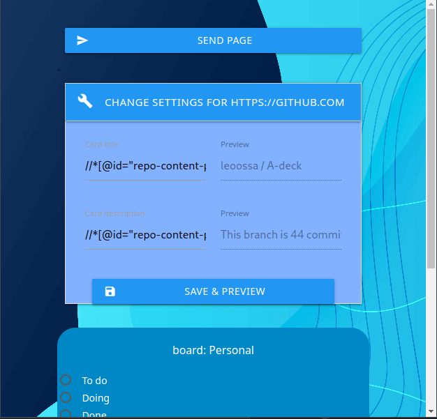
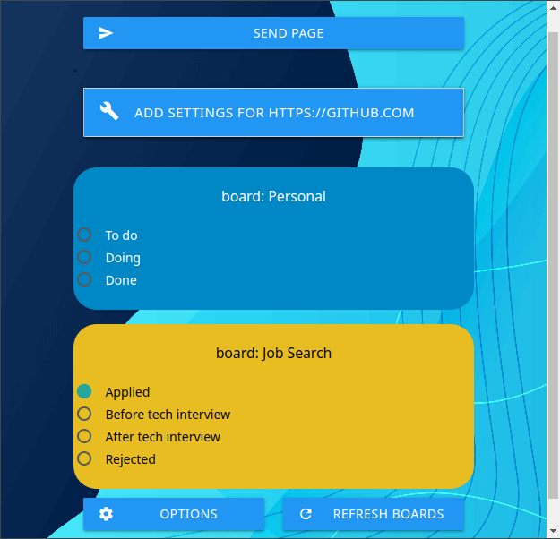

# A-deck

## Chrome extension for A-(dding websites to Nextcloud) Deck

Basically - it sends any webpage (current tab) to your **Deck** on your **Nextcloud** instance by creating a *card*. 

You can set up specific `Xpath` selectors for given domains.

Here's the option page:

Here's the popup with boards fetched from Nextcloud server (you can select which board and stack is default for sending pages)

The popup loads *boards* from server, also loads all the *stacks* and saves them into local browser storage. It uses *boards' color* as background color. 

### Currently in development:
- Adding to **Web Archive** in order not to have problems with vanishing websites

- better styling (including **UI/UX** and console log messages) - I know it looks terrible for now, but it's just a MVP - I'm still working on it
- Context menu (currently it's just an icon) -  allow user to send page to **different boards and stacks directly from context menu**
- 
- Taking **screenshots of website and including it as a attachment in card**
- apply naming conventions and guidelines, fix errors

### Ideas for further development:
~~- rules for specific domains (query selectors), that user can save in options and use them to fill card data sent to server (ie. instead of sending url and title user may input rulese to create card with 'h1' as title and 'p' as a description)~~
- domain based rules / global rules
- GUI query selector tool (easy for non-technical user) - similar to 

## RATIONALE

I saw [huntr.io board](https://huntr.co/demo/589189b5448fe5e45f01256c/board) to use for job searching and I thought that's a cool idea, but I want it to be on **my** server (that's **my** personal data) and I want to apply this kind of workflow wherever **I** want, not only to recruitment process. You can use it anyhow you like. 

Also - the English 'A deck' sound very similar to Polish 'Edek' which is the name 'Edward'. So - hello Edward ;) 

## Licence            
This package is [Treeware](https://treeware.earth). If you use it in production, then we ask that you [**buy the world a tree**](https://plant.treeware.earth/leoossa/A-deck) to thank us for our work. By contributing to the Treeware forest you’ll be creating employment for local families and restoring wildlife habitats.
